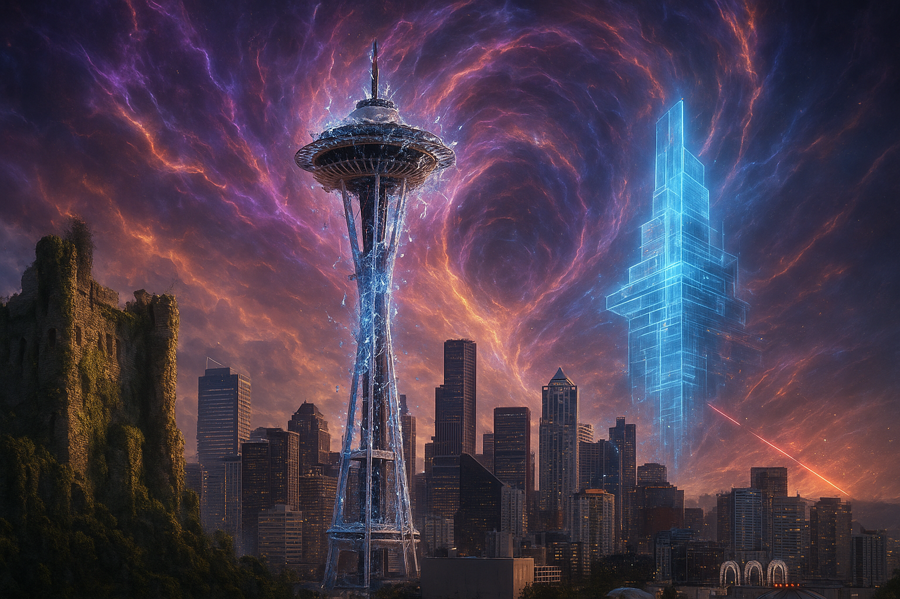

# Chrono Clash

The Collision was not an accident. This is the first, terrifying truth a **Chrono-Walker** internalizes, a shard of understanding amidst the temporal chaos. The present, fractured and bleeding moments from millennia past and future, is a deliberate construct. And its architects, the silent, unseen, and all-powerful entities whispered about in the fragmented chron-data streams and apochryphal texts, are known by a name that inspires both awe and a profound, existential dread: **The Vrathan**.

This project is a foundational example of an MMORPG server and a simple client. It demonstrates core concepts like basic networking, player movement on a large grid, and a character attribute system.

The current lore concept involves three time periods (Past, Present, Future) colliding, allowing for diverse character origins and playstyles.

## Project Goals

*   To explore and learn about building an MMORPG.
*   To implement a flexible character attribute and class system.
*   To create a very simple, accessible client for testing and basic gameplay.
*   To serve as a learning resource and a potential starting point for a more complex open-source MMO.

## Current Features

## Technology Stack

## Getting Started

### Prerequisites

### Building

### Running

## Future Development Ideas

*   **Persistence:** Database integration (e.g., PostgreSQL, SQLite) to save player data.
*   **Advanced Combat:** Implement skills, spells, damage calculations based on attributes.
*   **NPCs and Monsters:** Add non-player characters with AI.
*   **Terrain and World Details:** Define actual map terrain, interactable objects.
*   **Inventory and Items:** System for players to collect and use items.
*   **Quests:** Implement a questing system.
*   **Chat System:** Allow players to communicate.
*   **Improved Networking:** More robust serialization (e.g., Serde with Bincode/JSON), error handling, and security.
*   **Spatial Partitioning:** Optimize updates for large numbers of players (e.g., quadtrees).
*   **Graphical Client:** Eventually, a more visually appealing client (e.g., using Bevy, Fyrox, or a web client).
*   **Server Scalability:** Explore strategies for handling more concurrent users.

## Contributing
This project is open source and contributions are welcome! Please feel free to:

*   Report bugs or issues.
*   Suggest new features.
*   Submit pull requests for improvements or new functionality.

When contributing, please try to follow the existing code style and provide clear commit messages.

## License
This project is licensed under the [MIT License](LICENSE.md). As stated above, this is really just a learning project, so feel free to use it as a starting point for your own projects or to learn more about MMORPG development.
